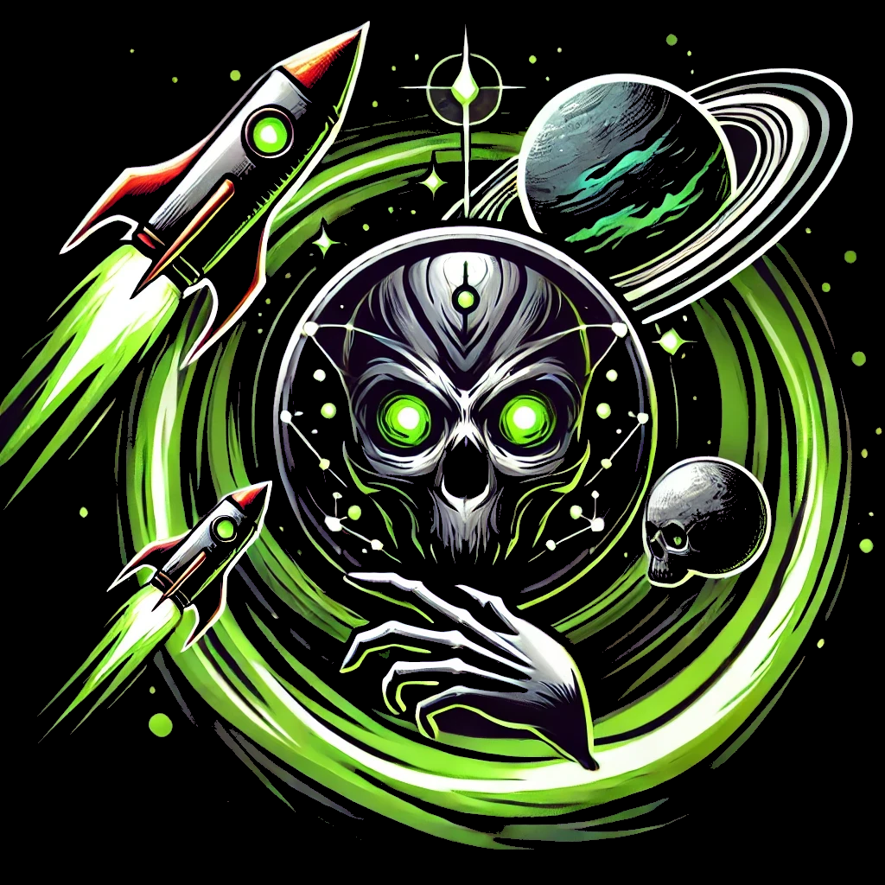
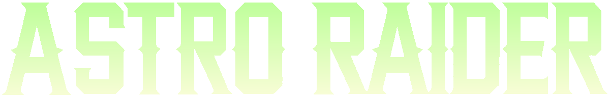

<p align="center">
  
</p>

<h1 align="center">Astro Raider</h1>

<p align="center">
  A 2D gravity-switching action game about mining, surviving, upgrading, and fighting your way through hostile worlds.
</p>

<p align="center">
  
  
</p>



## About

Astro Raider is a Godot-powered 2D game built around gravity-driven movement. Instead of simply walking, the player changes the direction of gravity, drills through terrain, collects resources, builds support structures, and uses perks to survive waves of enemies and boss encounters.

The project includes a custom gameplay loop with destructible ground, upgradeable player stats, perk choices, buildings, enemy AI behaviors, controller support, localization, and export presets for desktop builds.

## Features

- Gravity-switching movement with keyboard and controller input.
- Mining and destructible terrain for resource gathering.
- Combat with ranged weapons, drilling damage, knockback, shields, and status effects.
- Perk system with attack, defense, mining, movement, support, and utility upgrades.
- Placeable buildings such as turrets, repair stations, shield generators, and metal ground.
- Enemy AI templates, small enemies, environmental hazards, and boss encounters.
- Localized text resources for English, German, and Russian.
- Desktop export presets for Windows and Linux.

## Getting Started

### Requirements

- Godot 4.6 or the matching editor version configured for this project.
- Git for cloning the repository.
- Godot export templates if you want to create desktop builds.

### Run locally

```bash
git clone https://github.com/11samy02/AstroRaider.git
cd AstroRaider
```

Open `project.godot` in Godot and press `F5` to run the main scene:

```text
res://scenes/title/start_loading.tscn
```

## Controls

Controls are defined in `project.godot` and may change during development.

| Action | Keyboard / Mouse |
| --- | --- |
| Change gravity / move | `WASD` or arrow keys |
| Interact | `F` |
| Activate perk | `Space` |
| Building mode | `B` |
| Item / building slots | `Q`, `E`, `C`, `X` |
| Map zoom | `M` |
| Pull collected items | Right mouse button |
| Pause | `Esc` |

Gamepad input is supported through controller axes, D-pad input, and the in-game controller setup UI.

## Project Structure

```text
assets/      Art, sprites, UI textures, fonts, audio, and shaders
scenes/      Godot scene files
scripts/     GDScript gameplay, UI, systems, and resource logic
resources/   Data resources, perks, themes, generated levels, and localization
docs/        Project documentation and design documents
tests/       Test scenes and scripts
addons/      Godot plugins used by the project
```

More details are documented in [`docs/PROJECT_STRUCTURE.md`](docs/PROJECT_STRUCTURE.md).

## Development Status

Astro Raider is in active development. Systems, balancing, assets, and controls can still change as the game evolves.

## License

This project is licensed under the MIT License. See [`LICENSE`](LICENSE) for details.
